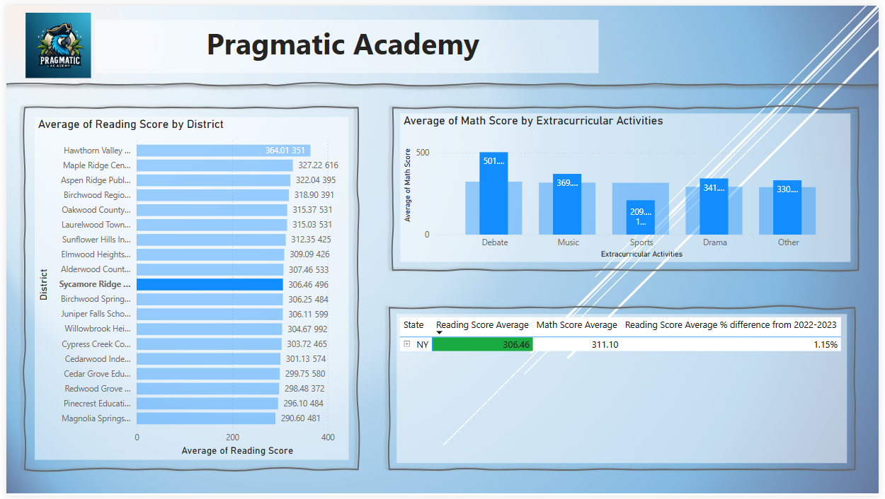

<!--Section 1: Introduce your self-->
## ABOUT ME
Organized and detail-oriented Executive Administrative Professional with a strong background in leadership, executive support, reporting, and process improvement. Experienced in managing schedules, coordinating reports, supporting high-level executives, and enhancing operational efficiency. Adept at using Microsoft Office (Excel, Word, PowerPoint), Power BI, and database management to streamline workflows and support decision-making.

Whether coordinating executive schedules, improving workflows, or providing technical support, I bring a proactive and solutions-oriented approach to every role.

<!--Mention your top/relevant skills here - core and soft skills-->
## WHAT I DO

**Data & Analysis**
	• Report Generation & Data Analysis (Excel, Power BI)
	• Data Visualization & Dashboard Creation (Power BI)
	• SQL & Database Management (MySQL, SQL)
	• Data Cleaning & Processing (Excel, Python - Basic)

**Process & Workflow Optimization**
	• Project Coordination & Process Improvement
	• Workflow Optimization & Automation
 
**Executive & Administrative Support**
	• Executive & Administrative Support
	• Calendar & Travel Management
	• Event Planning & Coordination
 
**Leadership & Operations**
	• Team Leadership & Performance Management
	• Customer Service & Conflict Resolution
 
**Technical & Systems Support**
	• Technical Support & Systems Administration
 
<!--Section 2: List 3-4 key projects-->
## PROJECTS
*A glimpse of some of the projects I've been working on.*

**Power Bi dashboard**

Brief summary of project

[Read More](link to live dashboard)

**Fancy Excel**

Brief summary of project

[Read More](link to live dashboard)

**Fancy Powerpoint**

Brief summary of project

[Read More](link to office 365)

## CONTACT

*Let’s connect and see how we can make a difference together!*
<table>
  <tbody>
    <tr>
      <td>📧</td>
      <td><a href="mailto:me@gmail.com">me@gmail.com</a></td>
    </tr>
    <tr>
      <td>📞</td>
      <td>(234) 816-763-7212</td>
    </tr>
    <tr>
      <td>📍</td>
      <td>MTL | QC | CANADA  </td>
    </tr>
    <tr>
      <td>⬇️</td>
      <td><a href="mbritton_ cv version 3_draft.pdf">Download my CV</a></td>
    </tr>
  </tbody>
</table>

   

